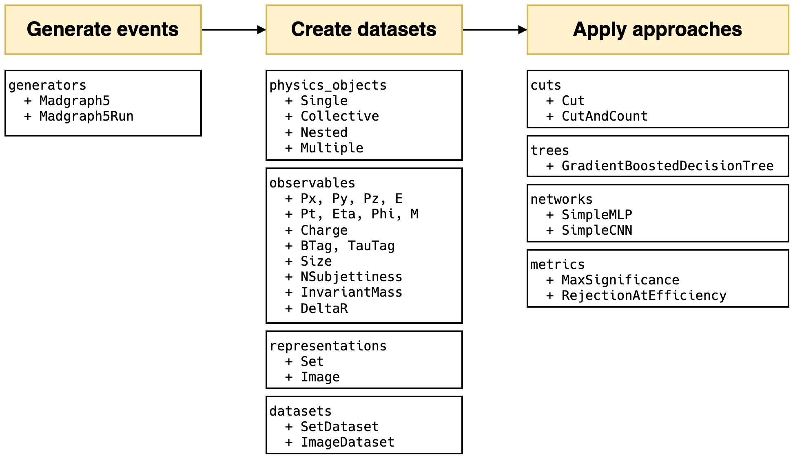

# HEP ML Lab (HML)
[](https://pypi.org/project/hep-ml-lab/)
[](https://pepy.tech/project/hep-ml-lab)
[](https://app.codecov.io/gh/Star9daisy/hep-ml-lab)
[](https://github.com/Star9daisy/hep-ml-lab/blob/main/LICENSE)

## Introduction
HEP-ML-Lab is an end-to-end framework used for research combining high-energy
physics phenomenology with machine learning. It covers three main parts: the
generation of simulated data, the conversion of data representation, and the
application of analysis approaches.

With HML, researchers can easily compare the performance between traditional
methods and modern machine learning algorithms, and obtain robust and
reproducible results.

To get started, please check out the [documents](https://star9daisy.github.io/hep-ml-lab/).

## Installation
```python
pip install hep-ml-lab
```

Check out the [install via pip](install/pip.md) for more details of prerequisites and post-installation steps or [install via Docker](install/docker.md) for a hassle-free experience.

## Module overview



- `hml.generators`: API of Madgraph5 for simulating colliding events;
- `hml.physics_objects`: Physics objects classfied by their counts;
- `hml.observables`: General observables in jet physics;
- `hml.representations`: Different data structure used to represent an event;
- `hml.datasets`: Existing datasets and helper classes for creating new datasets;
- `hml.approaches`: Cuts, trees and networks for classification;
- `hml.metrics`: Metrics used in classical signal vs background analysis;

## Updates

### v0.4.2
- Fix parsing cuts like "muon0.charge != muon1.charge".
- Fix inconsistent model layers in `hml.approaches.networks.SimpleCNN`.
- Fix registering and saving custom observables.
- Add cross sections, luminosity and weights as parameters in `hml.metrics.MaxSignificance`.
- Improve the figure ratio in `hml.datasets.SetDataset.show`.

### v0.4.1
- Fix module overview image in README.
- Fix `GradientBoostedDecisionTree` to be compatible with different `sklearn` versions.
- Fix `hml.datasets.SetDataset.show` to display the correct rows and columns.
- Rename the `parse` and `register` functions to `parse_physics_object`, `parse_observable`, and `register_observable`.
- Update the installation document.

### v0.4.0
This version refactors most of the codebase to make it compatible with the array
(from `awkward` and `uproot`) representation of the data.

### v0.3.0.1
- Fix a bug that Madgraph5 may run into an infinite loop caused by HML keeping
  removing py.py file during initialization.
- Fix nan value not implemented in Fileter.
- Fix the wrong order of runs when using `hml.generators.Madgraph5.runs` and
  `hml.generators.Madgraph5.summary`.
- Fix the typo "g1" in quickstart.

### v0.3.0
- New Madgraph5 API now is closer to the original Madgraph5 CLI.
- New Observable parsing system makes it easier to use and define new observables.
- New CutAndCout and BoostedDecisionTree in Keras style.

### v0.2.2
- Change output structure of `hml.generators.Madgraph5` to ensure reproducibility.
- Refactor `hml.generators.Madgraph5` and `hml.generators.MG5Run` to make
  them more robust.
### v0.2.1
- Add `summary` to `hml.generators.Madgraph5` to print a summary of all run.
- Add `remove` to `hml.generators.Madgraph5` to remove a run.
- Add `clean` to `hml.generators.Madgraph5` to remove the output directory.
