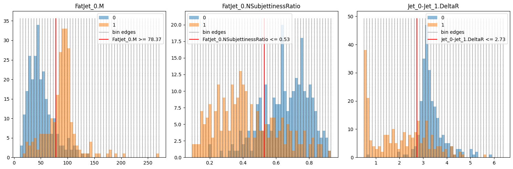

# Applying Approaches

This guide shows how to use the three built-in approaches to differentiate signal and background. HML streamlines the application of different approaches by adapting them in Keras-style (compile, fit, predict), which is simple to use.

Let's get started by importing the necessary modules:

```python
# Dataset
from hml.datasets import load_dataset
from sklearn.model_selection import train_test_split
# Approaches
from hml.approaches import CutAndCount as CBA
from hml.approaches import GradientBoostedDecisionTree as BDT
from hml.approaches import ToyMultilayerPerceptron as MLP
# Evaluation
from keras.metrics import Accuracy, AUC
from sklearn.metrics import roc_curve
from hml.metrics import MaxSignificance, RejectionAtEfficiency
from collections import defaultdict
from tabulate import tabulate
import matplotlib.pyplot as plt
import numpy as np
# Save and load
from hml.approaches import load_approach
```

## Loading the Dataset

`load_dataset` works similarly to `get_observable` — users do not need to know the specific class name for that dataset to use it:

```python
dataset = load_dataset("./data/zjj_vs_qcd.npz")
```

To split the whole dataset, use its properties `samples` and `targets`:

```python
x_train, x_test, y_train, y_test = train_test_split(
    dataset.samples, dataset.targets, test_size=0.3, random_state=42
)
x_train, x_val, y_train, y_val = train_test_split(
    x_train, y_train, test_size=0.2, random_state=42
)
```

## Cut and Count Approach

The cut-based analysis or cut and count approach is one of fundamental approaches widely used in HEP phenomenology . We implement it in Keras framework:

```python
approach1 = CBA()
approach1.compile(
    optimizer="adam",
    loss="sparse_categorical_crossentropy",
    metrics=["accuracy"],
)
history = approach1.fit(
    x_train,
    y_train,
    batch_size=len(x_train),
    validation_data=(x_val, y_val),
)
```

<div class="result" markdown>

```
1/1 [==============================] - 2s 2s/step - loss: 4.0295 - accuracy: 0.7500 - val_loss: 4.9923 - val_accuracy: 0.6903
```

</div>

- The `optimizer` in `compile` has no effect for CutAndCount because there are no learnable parameters.
- The `batch_size` is preferably the whole training set to show the complete distributions of observables. The `epochs` has no effect.

## Boosted Decision Tree

We adapt `GradientBoostingClassifier` from `sklearn` to work as a `Keras` model:

```python
approach2 = BDT()
approach2.compile(
    metrics=["accuracy"],
)
history = approach2.fit(
    x_train,
    y_train,
    validation_data=(x_val, y_val),
)
```

<div class="result" markdown>

```
100/100 [==============================] - 1s 8ms/step - loss: 0.4396 - accuracy: 0.9239 - val_loss: 1.2479 - val_accuracy: 0.5841
```

</div>

- The `optimizer` and `loss` have any effect in `compile` because `sklearn` will handle them internally.
- `batch_size` and `epochs` are irrelevant for a tree.
- The progress bar displays the number of estimators rather than training steps.

## Networks

Currently, HML provides a toy multi-layer perceptron to perform simple analysis:

```python
approach3 = MLP()
approach3.compile(
    loss="sparse_categorical_crossentropy",
    metrics=["accuracy"],
)
approach3.fit(
    x_train,
    y_train,
    batch_size=128,
    epochs=20,
    validation_data=(x_val, y_val),
)
```

<div class="result" markdown>

```
Epoch 1/20
8/8 [==============================] - 1s 34ms/step - loss: 13.7174 - accuracy: 0.5575 - val_loss: 10.6973 - val_accuracy: 0.5841
Epoch 2/20
8/8 [==============================] - 0s 19ms/step - loss: 10.3071 - accuracy: 0.5575 - val_loss: 8.0258 - val_accuracy: 0.5841
Epoch 3/20
8/8 [==============================] - 0s 19ms/step - loss: 7.5906 - accuracy: 0.5575 - val_loss: 5.7093 - val_accuracy: 0.5841
Epoch 4/20
8/8 [==============================] - 0s 21ms/step - loss: 5.1318 - accuracy: 0.5575 - val_loss: 3.5278 - val_accuracy: 0.5841
Epoch 5/20
8/8 [==============================] - 0s 19ms/step - loss: 2.8022 - accuracy: 0.5575 - val_loss: 1.2921 - val_accuracy: 0.5841
Epoch 6/20
8/8 [==============================] - 0s 22ms/step - loss: 0.8136 - accuracy: 0.6217 - val_loss: 0.5321 - val_accuracy: 0.8540
Epoch 7/20
8/8 [==============================] - 0s 19ms/step - loss: 0.4860 - accuracy: 0.8662 - val_loss: 0.5465 - val_accuracy: 0.7611
Epoch 8/20
8/8 [==============================] - 0s 20ms/step - loss: 0.4802 - accuracy: 0.8496 - val_loss: 0.5843 - val_accuracy: 0.7257
Epoch 9/20
8/8 [==============================] - 0s 19ms/step - loss: 0.4749 - accuracy: 0.8473 - val_loss: 0.6016 - val_accuracy: 0.6372
Epoch 10/20
8/8 [==============================] - 0s 22ms/step - loss: 0.4863 - accuracy: 0.8341 - val_loss: 0.5898 - val_accuracy: 0.7168
Epoch 11/20
8/8 [==============================] - 0s 19ms/step - loss: 0.4621 - accuracy: 0.8451 - val_loss: 0.5200 - val_accuracy: 0.7080
Epoch 12/20
8/8 [==============================] - 0s 19ms/step - loss: 0.4600 - accuracy: 0.8507 - val_loss: 0.6299 - val_accuracy: 0.7080
Epoch 13/20
8/8 [==============================] - 0s 20ms/step - loss: 0.4609 - accuracy: 0.8451 - val_loss: 0.5236 - val_accuracy: 0.7965
Epoch 14/20
8/8 [==============================] - 0s 22ms/step - loss: 0.4423 - accuracy: 0.8540 - val_loss: 0.5849 - val_accuracy: 0.7389
Epoch 15/20
8/8 [==============================] - 0s 20ms/step - loss: 0.4510 - accuracy: 0.8485 - val_loss: 0.4898 - val_accuracy: 0.8407
Epoch 16/20
8/8 [==============================] - 0s 20ms/step - loss: 0.4401 - accuracy: 0.8584 - val_loss: 0.4997 - val_accuracy: 0.8186
Epoch 17/20
8/8 [==============================] - 0s 20ms/step - loss: 0.4364 - accuracy: 0.8529 - val_loss: 0.5946 - val_accuracy: 0.7389
Epoch 18/20
8/8 [==============================] - 0s 20ms/step - loss: 0.4432 - accuracy: 0.8429 - val_loss: 0.4955 - val_accuracy: 0.8186
Epoch 19/20
8/8 [==============================] - 0s 20ms/step - loss: 0.4246 - accuracy: 0.8518 - val_loss: 0.4807 - val_accuracy: 0.8496
Epoch 20/20
8/8 [==============================] - 0s 19ms/step - loss: 0.4228 - accuracy: 0.8418 - val_loss: 0.6476 - val_accuracy: 0.6283
```

</div>

## Evaluation

To benchmark these approaches, we use:

- `Accuracy` and `Auc` to show overall performance;
- `roc_curve` to display tradeoff between thresholds and performance;
- `MaxSignificance` and `RejectionAtEfficiency`, crucial ones in phenomenology studies.

```python
benchmark = defaultdict(list)
for approach in [approach1, approach2, approach3]:
    y_prob = approach.predict(x_test, verbose=0)
    y_pred = y_prob.argmax(axis=1)

    benchmark["Name"].append(approach.name)
    benchmark["ACC"].append(Accuracy()(y_test, y_pred).numpy())
    benchmark["AUC"].append(AUC()(y_test, y_prob[:, 1]).numpy())
    benchmark["MaxSignificance"].append(MaxSignificance()(y_test, y_prob[:, 1]).numpy())
    benchmark["RejectionAtEfficiency"].append(RejectionAtEfficiency(0.5)(y_test, y_prob[:, 1]).numpy())

    fpr, tpr, _ = roc_curve(y_test, y_prob[:, 1])
    plt.plot(fpr, tpr, label=f"{approach.name}")

print(tabulate(benchmark, headers="keys", tablefmt="github"))

plt.title("ROC Curves")
plt.xlabel("Efficiency")
plt.ylabel("Mistag Rate")
plt.legend()
plt.show()
```

<div class="result" markdown>

| Name                           |      ACC |      AUC |   MaxSignificance |   RejectionAtEfficiency |
|--------------------------------|----------|----------|-------------------|-------------------------|
| cut_and_count                  | 0.729897 | 0.721404 |          10.1985  |                   1     |
| gradient_boosted_decision_tree | 0.876289 | 0.93703  |          13.3053  |                 125     |
| toy_multilayer_perceptron      | 0.610309 | 0.915157 |           6.78387 |                 249.999 |


</div>

## Show Information

To clear show information of different Keras-based approaches, we use `summary`:

```python
approach1.summary()
approach2.summary()
approach3.summary()
```

<div class="result" markdown>

```
Model: "cut_and_count"
_________________________________________________________________
 Layer (type)                Output Shape              Param #   
=================================================================
=================================================================
Total params: 10 (40.00 Byte)
Trainable params: 0 (0.00 Byte)
Non-trainable params: 10 (40.00 Byte)
_________________________________________________________________
n_bins: 50
cuts:
  #1: x >= 78.3743
  #2: x <= 0.5286
  #3: x <= 2.7339
Model: "gradient_boosted_decision_tree"
- ccp_alpha: 0
- criterion: friedman_mse
- init: None
- learning_rate: 0.1
- loss: log_loss
- max_depth: 3
- max_features: None
- max_leaf_nodes: None
- min_impurity_decrease: 0
- min_samples_leaf: 1
- min_samples_split: 2
- min_weight_fraction_leaf: 0
- n_estimators: 100
- n_iter_no_change: None
- name: gradient_boosted_decision_tree
- random_state: None
- subsample: 1
- tol: 0.0001
- validation_fraction: 0.1
- verbose: 0
- warm_start: False
Model: "toy_multilayer_perceptron"
_________________________________________________________________
 Layer (type)                Output Shape              Param #   
=================================================================
 dense (Dense)               multiple                  40        
                                                                 
 dense_1 (Dense)             multiple                  110       
                                                                 
 dense_2 (Dense)             multiple                  22        
                                                                 
=================================================================
Total params: 172 (688.00 Byte)
Trainable params: 172 (688.00 Byte)
Non-trainable params: 0 (0.00 Byte)
_________________________________________________________________
```

</div>

Let’s plot the cuts on distributions to show if it’s fair enough:

```python
fig, axs = plt.subplots(1, 3, figsize=(15, 5))
for index in range(x_train.shape[1]):
    case = approach1.cases[index]
    cuts = approach1.cuts[index]
    observable = dataset.feature_names[index]
    bin_edges = np.linspace(x_train[:, index].min(), x_train[:, index].max(), approach1.n_bins+1)

    axs[index].hist(x_test[:, index][y_test == 0], bins=bin_edges, alpha=0.5, label="0")
    axs[index].hist(x_test[:, index][y_test == 1], bins=bin_edges, alpha=0.5, label="1")

    y_min, y_max = axs[index].get_ylim()
    axs[index].vlines(bin_edges, y_min, y_max, color="k", ls="dashed", lw=0.5, label="bin edges")

    if case == 0:
        axs[index].vlines(cuts[0], y_min, y_max, color="r", label=f"{observable} <= {cuts[0]:.2f}")
    elif case == 1:
        axs[index].vlines(cuts[0], y_min, y_max, color="r", label=f"{observable} >= {cuts[0]:.2f}")
    elif case == 2:
        axs[index].vlines(cuts[0], y_min, y_max, color="r", label=f"{cuts[0]:.2f} <= {observable} <= {cuts[1]:.2f}")
        axs[index].vlines(cuts[1], y_min, y_max, color="r")
    else:
        axs[index].vlines(cuts[0], y_min, y_max, color="r", label=f"{observable} <= {cuts[0]:.2f} or {observable} >= {cuts[1]:.2f}")
        axs[index].vlines(cuts[1], y_min, y_max, color="r")

    axs[index].set_title(f"{observable}")
    axs[index].legend()

plt.tight_layout()
plt.show()
```

<div class="result" markdown>



</div>

## Save and load approaches

After `fit` each approach, use `save` to save it to a file. To make folder structure clean, let’s create a folder named “checkpoints” first:

```bash
mkdir checkpoints
```

Then, in your codes or the notebook:

```python
approach1.save("./checkpoints/CBA.keras")
approach2.save("./checkpoints/BDT.pickle")
approach3.save("./checkpoints/MLP.keras")
```

Once again, we use `load_approach` to let HML decide which class it actually is, just like `get_observable`, `load_dataset`:

```python
loaded_approach1 = load_approach("./checkpoints/CBA.keras")
loaded_approach2 = load_approach("./checkpoints/BDT.pickle")
loaded_approach3 = load_approach("./checkpoints/MLP.keras")

assert (approach1.cuts.numpy() == loaded_approach1.cuts.numpy()).all()
assert approach2.n_estimators_ == loaded_approach2.n_estimators_
assert approach3.count_params() == loaded_approach3.count_params()
```

Check the doc to learn more about [cuts](../api-reference/hml.approaches/cuts.md), [trees](../api-reference/hml.approaches/trees.md), and networks.
