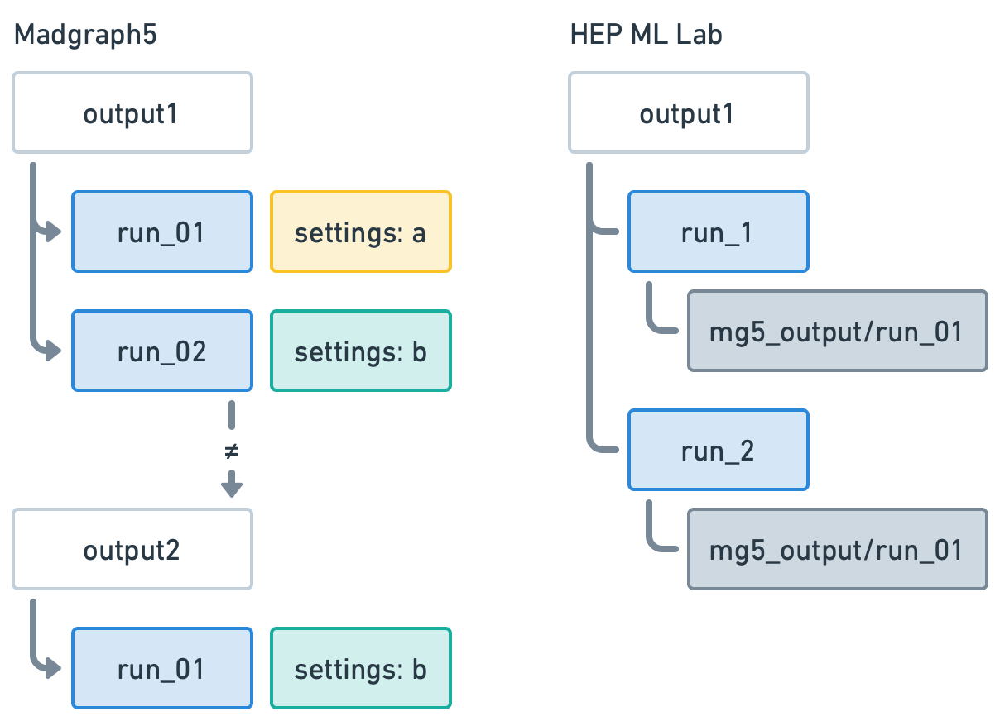

# Generate events
We will use Madgraph5 (MG5) command line interface (CLI) and the custom MG5 API
(application programming interface) built in HML (HEP ML Lab) to show how users
could benefit from HML framework.

## Launch one run
First, let’s pick this process: `p p > z z, z > j j, z > vl vl~`. To speed up
generation, we only generate 1000 events for demonstraction. To ensure all the
results are as reproducible as possible, we also set random seed as 42, quite
common one in machine learning community.

### Use MG5
We could type the following commands in MG5 CLI one by one. It's better write
them into a file and run it via `mg5_aMC one_run_from_mg5.mad` (the suffix
`.mad` is not necessary but only respects the naming convention in programs
related to MG5 like MadEvent, MadSpin, MadAnalysis...).

``` py title="one_run_from_mg5.mad"
generate p p > z z, z > j j, z > vl vl~
output data/one_run_from_mg5.mad #(1)!
launch -i #(2)!
generate_events #(3)!
set nevents 1000
set iseed 42
print_results --path=data/one_run_from_mg5_results --format=short #(4)!
```

1. Remember to `mkdir data` before running the script.
2. Launch with the option `-i, --interactive` to generate events using the
   interactive console of MadEvent.You can drop it and launch as usual
   without the next line `generate_events`.
3. This is a command from MadEvent. There's also a command `multi_run <n_runs>`
   to generate multiple runs.
4. This is also a command from MadEvent. It has some bugs when launching
   multiple times. So it's recommended to save the results to a file as such and
   check it later.

!!! note
    The output name `one_run_from_mg5` is not a good practice. It's better to
    include the process information in the name, like `pp2zz_z2jj_z2vlvl`.

### Use HML
To use HML, we use a jupyter notebook for demonstration. You can also write a
python script for normal usage.

``` py title="all_runs_from_hml.ipynb"
from hml.generators import Madgraph5

g = Madgraph5(
    executable="mg5_aMC",
    processes=["p p > z z, z > j j, z > vl vl~"],
    output="data/all_runs_from_hml",
    n_events=1000,
    seed=42,
)
```

HML convert the parameters to MG5 commands internally. Let's examine this to
make sure everything is going well:

``` py title="all_runs_from_hml.ipynb"
g.commands
```

<div class="result" markdown>

``` py
['import model sm',
 'generate p p > z z, z > j j, z > vl vl~',
 'output mg5_output',
 'launch -i',
 'multi_run 1', #(1)!
 'shower=off',
 'detector=off',
 'set nevents 1000',
 'set iseed 42',
 'set run_tag no_tags',
 'print_results --path=results --format=short']
```

1. HML uses `multi_run` to generate multiple runs, which is not optimal as MG5
   indicates. However, it's a not good solution to keep all launched runs in the
   same structure considering both small number of events and large ones for
   training machine learning models.

</div>

!!! note
    The output `mg5_output` and `results` in `print_results` are placed in the
    "current" directory which is one folder inside data/all_runs_from_hml. HML
    changes the output structure for better reproducibility. We'll
    discuss this later.

Now we can move on confidently:

``` py title="all_runs_from_hml.ipynb"
...
g.launch()
```

<div class="result" markdown>

```
Generating events...
Storing files...
Done
```

</div>

## Check results of generation
It's crucial to get the information like cross section and error everytime we
have finished a run.

### Use MG5
To check these information in MG5 workflow, we could read it directly from the
console output such as:

``` title="MG5 CLI"
...
INFO:  
  === Results Summary for run: run_01 tag: tag_1 ===

     Cross-section :   1.989 +- 0.01324 pb
     Nb of events :  1000
...
```

But it's better to save it to a file and access it later. We have done this in
the previous section using the command `print_results`:

``` title="data/one_run_from_mg5_results"
# run_name tag cross error Nb_event cross_after_matching nb_event_after matching
run_01 tag_1 1.9892400000000001 0.013241815989130797 1000
```

### Use HML
From `g.commands` we can see that HML has saved the results to a file as well.
It helps read the file and parse the information. Use `summary()` to show the
results:

``` py title="all_runs_from_hml.ipynb"
g.summary()
```

<div class="result" markdown>

```
                   p p > z z, z > j j, z > vl vl~                    
┏━━━┳━━━━━━━━━━┳━━━━━━━━━┳━━━━━━━━━━━━━━━━━━━━━━━━┳━━━━━━━━━━┳━━━━━━┓
┃ # ┃ Name     ┃ Tags    ┃   Cross section (pb)   ┃ N events ┃ Seed ┃
┡━━━╇━━━━━━━━━━╇━━━━━━━━━╇━━━━━━━━━━━━━━━━━━━━━━━━╇━━━━━━━━━━╇━━━━━━┩
│ 0 │ run_1[1] │ no_tags │ 1.989e+00 +- 1.324e-02 │    1,000 │   42 │
└───┴──────────┴─────────┴────────────────────────┴──────────┴──────┘
                    Output: data/all_runs_from_hml                    
```

</div>

Of course, we can also access every single value in the summary:

``` py title="all_runs_from_hml.ipynb"
for i, run in enumerate(g.runs):
    print(f"# {i}")
    print(f"Name: {run.name}[{run.n_subruns}]")
    print(f"Tags: {run.tag}")
    print(f"Cross section (pb): {run.cross_section} +- {run.error}")
    print(f"N Events: {run.n_events}")
    print(f"Seed: {run.seed}")
```

<div class="result" markdown>

```
# 0
Name: run_1[1]
Tags: no_tags
Cross section (pb): 1.9892400000000003 +- 0.013241815989130797
N Events: 1000
Seed: 42
```

</div>

## Change settings and launch again
Next we want to change some settings and launch again. For example, we want to
generate 10000 events and change the minimum pt and the maximum eta of jets.

### Use MG5
For MG5, we could change these settings via its CLI or modify the run_card.dat,
or write all commands into a script file:

``` py title="two_runs_from_mg5.mad"
generate p p > z z, z > j j, z > vl vl~
output data/two_runs_from_mg5
launch -i
generate_events
    set nevents 1000 #(1)!
    set iseed 42
generate_events
   set nevents 10000 #(2)!
   set iseed 42
   set ptj 10.0
   set etaj 2.4
   set run_tag ptj=10,etaj=2.4 #(3)!
print_results --path=data/two_runs_from_mg5_results --format=short
```

1. The indentation is not necessary but it's better to make the script more
   readable.
3. The default value of `nevents` is exactly 10000. So it's ok to drop this line.
4. It's a good practice to add a tag to the run. Tags will show up in the results
   file and help us identify the run.

``` title="data/two_runs_from_mg5_results"
# run_name tag cross error Nb_event cross_after_matching nb_event_after matching
run_01 tag_1 1.9892400000000001 0.013241815989130797 1000
run_02 ptj=10,etaj=2.4 1.96801 0.006981887808465559 10000
```

### Use HML
For HML, as `settings` is a dictionary, we could change the settings directly:

``` py title="all_runs_from_hml.ipynb"
g.n_events = 10000
g.settings["ptj"] = 10.0
g.settings["etaj"] = 2.4
g.tags = ["ptj=10", "etaj=2.4"]

g.launch()
```

<div class="result" markdown>

```
                       p p > z z, z > j j, z > vl vl~                        
┏━━━┳━━━━━━━━━━┳━━━━━━━━━━━━━━━━━┳━━━━━━━━━━━━━━━━━━━━━━━━┳━━━━━━━━━━┳━━━━━━┓
┃ # ┃ Name     ┃ Tags            ┃   Cross section (pb)   ┃ N events ┃ Seed ┃
┡━━━╇━━━━━━━━━━╇━━━━━━━━━━━━━━━━━╇━━━━━━━━━━━━━━━━━━━━━━━━╇━━━━━━━━━━╇━━━━━━┩
│ 0 │ run_1[1] │ no_tags         │ 1.989e+00 +- 1.324e-02 │    1,000 │   42 │
│ 1 │ run_2[1] │ ptj=10,etaj=2.4 │ 1.976e+00 +- 6.010e-03 │   10,000 │   42 │
└───┴──────────┴─────────────────┴────────────────────────┴──────────┴──────┘
                       Output: data/all_runs_from_hml                        
```

</div>

## What's the difference between HML and MG5?
During we try some launches, by accident we find that MG5 may generate events
with different results even we have set the same random seed. We always test
HML with `n_events=1000` and `seed=42`, and the results are not consistent.

This is pretty confusing as the two runs have exactly the same settings but
result in different cross section and error. To avoid this, the best practice is
output every time you change settings so that each output contains only one run.

So HML reorganize the output structure as follows:

<figure markdown>
  {width="500"}
  <figcaption>Image caption</figcaption>
</figure>

!!! warning
    As we try more runs, we find that this inconsistency only happens when the
    `n_events=1000` and This situation will only occur in the first run. We'll
    change back to the original Madgraph5 output structure in the later version
    of HML.

Let’s launch a run with the same settings multiple times to demonstrate we truly
make the results fixed.

``` title="three_same_runs_from_mg5.mad"
generate p p > z z, z > j j, z > vl vl~
output data/three_same_runs_from_mg5
launch -i
generate_events
    set nevents 1000
    set iseed 42
    
generate_events
    set nevents 1000
    set iseed 42

generate_events
    set nevents 1000
    set iseed 42
print_results --path=data/three_same_runs_from_mg5/results --format=short
```

<div class="result" markdown>

```
# run_name tag cross error Nb_event cross_after_matching nb_event_after matching
run_01 tag_1 1.9892400000000001 0.013241815989130797 1000
run_02 tag_1 1.95144 0.013508039407700881 1000
run_03 tag_1 1.95144 0.013508039407700881 1000
```
</div>


``` py title="all_runs_from_hml.ipynb"
g.n_events = 1000
del g.settings["ptj"]
del g.settings["etaj"]
g.tags = []

for i in range(3):
    g.launch()

g.summary()
```

<div class="result" markdown>

```
                       p p > z z, z > j j, z > vl vl~                        
┏━━━┳━━━━━━━━━━┳━━━━━━━━━━━━━━━━━┳━━━━━━━━━━━━━━━━━━━━━━━━┳━━━━━━━━━━┳━━━━━━┓
┃ # ┃ Name     ┃ Tags            ┃   Cross section (pb)   ┃ N events ┃ Seed ┃
┡━━━╇━━━━━━━━━━╇━━━━━━━━━━━━━━━━━╇━━━━━━━━━━━━━━━━━━━━━━━━╇━━━━━━━━━━╇━━━━━━┩
│ 0 │ run_1[1] │ no_tags         │ 1.989e+00 +- 1.324e-02 │    1,000 │   42 │
│ 1 │ run_2[1] │ ptj=10,etaj=2.4 │ 1.976e+00 +- 6.010e-03 │   10,000 │   42 │
│ 2 │ run_3[1] │ no_tags         │ 1.989e+00 +- 1.324e-02 │    1,000 │   42 │
│ 3 │ run_4[1] │ no_tags         │ 1.989e+00 +- 1.324e-02 │    1,000 │   42 │
│ 4 │ run_5[1] │ no_tags         │ 1.989e+00 +- 1.324e-02 │    1,000 │   42 │
└───┴──────────┴─────────────────┴────────────────────────┴──────────┴──────┘
                       Output: data/all_runs_from_hml                        
```

</div>

Now, we can safely control the results via the random_seed and build the ground
for reproducibility.