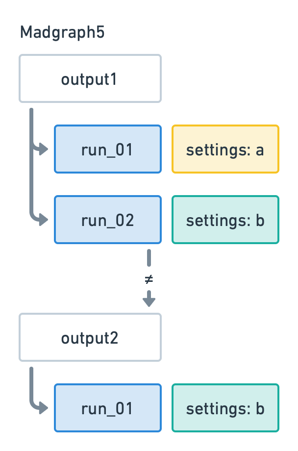
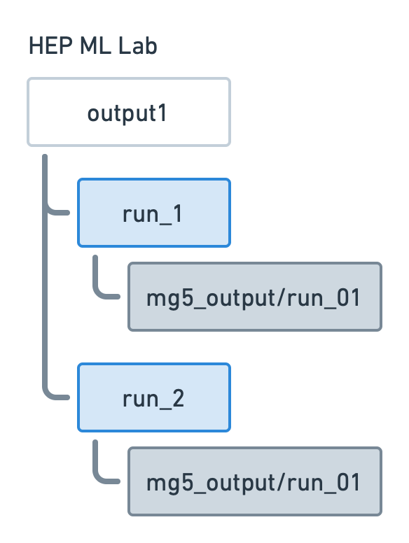

# Generate events
We will use Madgraph5 (MG5) command line interface (CLI) and the custom MG5 API
(application programming interface) built in HML (HEP ML Lab) to show how users
could benefit from HML framework.

## Launch one run
First, let’s pick this process: `p p > z z, z > j j, z > vl vl~`. To speed up
generation, we only generate 1000 events for demonstraction. To ensure all the
results are as reproducible as possible, we also set random seed as 42, quite
common one in machine learning community.

### Use MG5
We could type the following commands in MG5 CLI one by one. It's better write
them into a file and run it via `mg5_aMC one_run_from_mg5.mad` (the suffix
`.mad` is not necessary but only respects the naming convention in programs
related to MG5 like MadEvent, MadSpin, MadAnalysis...).

``` py title="one_run_from_mg5.mad"
generate p p > z z, z > j j, z > vl vl~
output data/one_run_from_mg5.mad #(1)!
launch -i #(2)!
generate_events #(3)!
set nevents 1000
set iseed 42
print_results --path=data/one_run_from_mg5_results --format=short #(4)!
```

1. Remember to `mkdir data` before running the script.
2. Launch with the option `-i, --interactive` to generate events using the
   interactive console of MadEvent.You can drop it and launch as usual
   without the next line `generate_events`.
3. This is a command from MadEvent. There's also a command `multi_run <n_runs>`
   to generate multiple runs.
4. This is also a command from MadEvent. It has some bugs when launching
   multiple times. So it's recommended to save the results to a file as such and
   check it later.

!!! note
    The output name `one_run_from_mg5` is not a good practice. It's better to
    include the process information in the name, like `pp2zz_z2jj_z2vlvl`.

### Use HML
To use HML, we use a jupyter notebook for demonstration. You can also write a
python script for normal usage.

``` py title="one_run_from_hml.ipynb"
from hml.generators import Madgraph5

g = Madgraph5(
    executable="mg5_aMC",
    processes=["p p > z z, z > j j, z > vl vl~"],
    output="data/one_run_from_hml",
    n_events=1000,
    seed=42,
)
```

HML convert the parameters to MG5 commands internally. Let's check this:

``` py title="one_run_from_hml.ipynb"
g.commands
```

<div class="result" markdown>

```
['import model sm',
 'generate p p > z z, z > j j, z > vl vl~',
 'output mg5_output',
 'launch -i',
 'multi_run 1',
 'shower=off',
 'detector=off',
 'set nevents 1000',
 'set iseed 42',
 'set run_tag no_tags',
 'print_results --path=results --format=short']
```

</div>

Now we can move on confidently:

``` py title="one_run_from_hml.ipynb"
...
g.launch()
```

<div class="result" markdown>

```
Generating events...
Storing files...
Done
```

</div>

## Check results of generation

It’s just the same as the left commands we type into MG5 CLI. To check cross
section, let’s do this:

``` title="data/results"
# run_name tag cross error Nb_event cross_after_matching nb_event_after matching
run_01 tag_1 1.9892400000000003 0.013241815989130797 1000
```

``` py title="one_run_from_hml.ipynb"
g.summary()
```

<div class="result" markdown>

```
                   p p > z z, z > j j, z > vl vl~                    
┏━━━┳━━━━━━━━━━┳━━━━━━━━━┳━━━━━━━━━━━━━━━━━━━━━━━━┳━━━━━━━━━━┳━━━━━━┓
┃ # ┃ Name     ┃ Tags    ┃   Cross section (pb)   ┃ N events ┃ Seed ┃
┡━━━╇━━━━━━━━━━╇━━━━━━━━━╇━━━━━━━━━━━━━━━━━━━━━━━━╇━━━━━━━━━━╇━━━━━━┩
│ 0 │ run_1[1] │ no_tags │ 1.989e+00 +- 1.324e-02 │    1,000 │   42 │
└───┴──────────┴─────────┴────────────────────────┴──────────┴──────┘
                    Output: data/one_run_from_hml                    
```

</div>

To access the cross section, for the results file you may write a little script
to resolve it and retrieve the value. For HML, Madgraph5 API has done this for
you.

``` py title="one_run_from_hml.ipynb"
for i, run in enumerate(g.runs):
    print(f"# {i}")
    print(f"Name: {run.name}[{run.n_subruns}]")
    print(f"Tags: {run.tag}")
    print(f"Cross section (pb): {run.cross_section} +- {run.error}")
    print(f"N Events: {run.n_events}")
    print(f"Seed: {run.seed}")
```

<div class="result" markdown>

```
# 0
Name: run_1[1]
Tags: no_tags
Cross section (pb): 1.9892400000000003 +- 0.013241815989130797
N Events: 1000
Seed: 42
```

</div>

All info shown in `summary` could be retrieved via HML Madgraph5 API.

## Change settings and launch again
When you’re ready to change some settings in different cards when launching a
run (run_card, params_card, pythia8_card, delphes_card), HML Madgraph5 API
behaves almost like the Madgraph5 itself.

``` title="MG5 CLI"
# in run_card.dat
10000 = nevents -> 1000 = nevents # less events to be generated
20.0  = ptj     -> 10.0 = ptj # jets with broader pt range
```

``` py title="HML jupyter notebook"
g.n_events = 1000
g.settings["ptj"] = 10.0
g.settings["etaj"] = 2.4
```

## What's the difference between HML and MG5 CLI?
Then launches as the same as the first run. After some try, you could specify
some settings are needed, so you output a new folder. However, you may notice
that results differ from each other when they have different order in a roll,
even we have set the same random seed!

<figure markdown>
  { width="200" }
  <figcaption>Image caption</figcaption>
</figure>

<figure markdown>
  { width="200" }
  <figcaption>Image caption</figcaption>
</figure>

This is pretty confusing as the two runs have exactly the same settings but
result in different cross section and error. To avoid this, the best practice is
output every time you change settings so that each output contains only one run.

So HML reorganize the output structure as follows:

Let’s launch a run with the same settings multiple times to demonstrate we truly
make the results fixed.

``` title="Madgraph5"
import model sm
generate p p > z z, z > j j, z > vl vl~
output data/mg5_run_3_times
launch -i
    generate_events
    set nevents 1000
    set iseed 42

    generate_events
    generate_events
    
    print_results --path=results --format=short
```

<div class="result" markdown>

```
# run_name tag cross error Nb_event cross_after_matching nb_event_after matching
run_01 tag_1 1.9892400000000001 0.013241815989130797 1000
run_02 tag_1 1.96681 0.013548581768214708 1000
run_03 tag_1 1.97885 0.015050913552339605 1000
```

</dev>

``` py title="HML API"
for i in range(3):
    g.launch()

g.summary()
```

<div class="result" markdown>

```
p p > z z, z > j j, z > vl vl~                    
┏━━━┳━━━━━━━━━━┳━━━━━━━━━┳━━━━━━━━━━━━━━━━━━━━━━━━┳━━━━━━━━━━┳━━━━━━┓
┃ # ┃ Name     ┃ Tags    ┃   Cross section (pb)   ┃ N events ┃ Seed ┃
┡━━━╇━━━━━━━━━━╇━━━━━━━━━╇━━━━━━━━━━━━━━━━━━━━━━━━╇━━━━━━━━━━╇━━━━━━┩
│ 0 │ run_1[1] │ no_tags │ 1.989e+00 +- 1.324e-02 │    1,000 │   42 │
│ 1 │ run_2[1] │ no_tags │ 1.989e+00 +- 1.324e-02 │    1,000 │   42 │
│ 2 │ run_3[1] │ no_tags │ 1.989e+00 +- 1.324e-02 │    1,000 │   42 │
└───┴──────────┴─────────┴────────────────────────┴──────────┴──────┘
                   Output: data/pp2zz_z2jj_z2vlvl
```

</div>

Now, we can safely control the results via the random_seed and build the ground
for reproducibility.