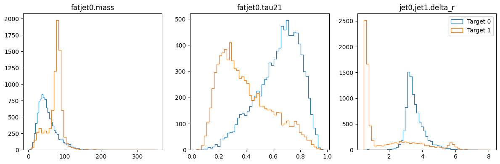
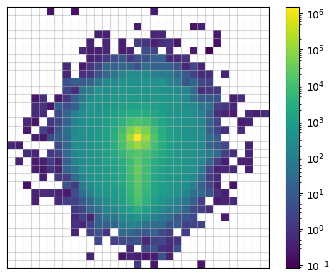
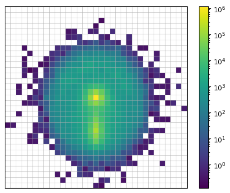

# Create datasets

This guide demonstrates how to use observable parsing system to create a dataset for future use. With this system, you can create and use observables not only with specific classes but also with simple strings.

Start by importing the necessary modules:

```python
import uproot
from hml.generators import Madgraph5
from hml.representations import Image
from hml.datasets import SetDataset, ImageDataset
from hml.approaches import Cut
```

## Load generated events

As the previous guide showed, HML can handle two cases. Here, we use the `Madgraph5` class to fetch runs from the output directory:

```python
wjj = Madgraph5.from_output("data/pp2wz@10k", "mg5_aMC")
qcd = Madgraph5.from_output("data/pp2jj@10k", "mg5_aMC")

wjj_events = uproot.open(wjj.runs[0].events()[0])
qcd_events = uproot.open(qcd.runs[0].events()[0])
```

## Preselection

For the processes, we choose three observables: mass and n-subjettiness ratio of the leading fat jet, and the angular distance between the leading and subleading jets. To ensure we can obtain the observables without missing value, it’s necessary to preselect or filter events based on the number of fat jets and jets:

```python
preselection = Cut("fatjet.size > 0 and jet.size > 1")
preselection.read(wjj_events)
preselection.value
```

<div class="result" markdown>

```
[True,
 True,
 True,
 True,
 True,
 False,
 True,
 True,
 False,
 True,
 ...,
 False,
 True,
 True,
 True,
 False,
 True,
 True,
 False,
 False]
------------------
type: 10000 * bool
```

</div>

- `fatjet.size` is the observable `Size` associated with the physics object `fatjet`. This observable refers to the number of the objects. In a root file, it applies to an entire branch. The physics object corresponds to the branch name (case-insensitive).
- An observable is always linked to one or more physics objects. This concept inspires HML to create its own observable parsing system: `<physics_object>,<another>.<observable>`. The `physics_object` is any branch defined in your root file. Multiple objects are separated by `,`. For a single object, specify the index directly after the object name, e.g., "jet0", "muon1".

To extract the observable values, use the `read` method, which returns a boolean list. The `value` attribute stores the result.

## Create a set dataset

Now, we use the 1D data container `SetDataset` to hold these three observables for all events:

```python
cut = "fatjet.size > 0 and jet.size > 1"

set_ds = SetDataset(["fatjet0.mass", "fatjet0.tau21", "jet0,jet1.delta_r"])
set_ds.read(wjj_events, 1, [cut])
set_ds.read(qcd_events, 0, [cut])
```

To confirm our choice of observables is powerful enough to differentiate the signal and background, we use `show` to plot three distributions:

```python
ds.show()
```

<div class="result" markdown>



</div>

Right before saving the dataset to the disk, we use the `split` method to divide the dataset into training and testing sets:

```python
set_ds.split(0.7, 0.3, seed=42)
print(set_ds.train.samples.shape)
print(set_ds.train.targets.shape)

set_ds.save("data/wjj_vs_qcd_set.ds")
```

<div class="result" markdown>

```
(12644, 3)
(12644,)
```

</div>

The `split` method also supports the validation set: `set_ds.split(0.7, 0.2, 0.1)`.

## Create an image dataset

Besides a set dataset, we can also represent each event as an image and then create a dataset of these images.

```python
image_ds = ImageDataset(
    Image(
        height="fatjet0.constituents.phi",
        width="fatjet0.constituents.eta",
        channel="fatjet0.constituents.pt",
    )
    .with_subjets("fatjet0.constituents", "kt", 0.3, 0)
    .translate(origin="SubJet0")
    .rotate(axis="SubJet1", orientation=-90)
    .pixelate(size=(33, 33), range=[(-1.6, 1.6), (-1.6, 1.6)])
)
```

- The `Image` class is a representation of the image. It takes three arguments: `height`, `width`, and `channel`. The `height` and `width` are the observables for the y-axis and x-axis, respectively. The `channel` is the observable for the pixel intensity.
- The `with_subjets` method adds subjets to the image.
- The `translate` method moves the origin of the image to the subjet.
- The `rotate` method rotates the image.
- The `pixelate` method pixelates the image. This step makes the points discrete and produce the real image.

To create the image dataset, we still use the `read` method:

```python
image_ds.read(sig_events, 1, [cut])
image_ds.read(bkg_events, 0, [cut])
```

To visualize the images, there is also a `show` method:

```python
image_ds.show(norm="log", target=0, show_pixels=True)
image_ds.show(norm="log", target=1, show_pixels=True)
```

<div class="result" markdown>




</div>

Finally, we split and save the dataset:

```python
image_ds.split(0.7, 0.3, seed=42)
image_ds.save("data/wjj_vs_qcd_image.ds")
```

Check the doc to learn more about [observables](../api/hml.observables.md), [representations](../api/hml.representations.md) and [datasets](../api/hml.datasets.md).
