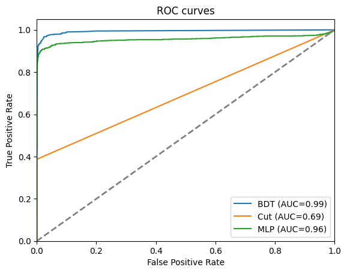
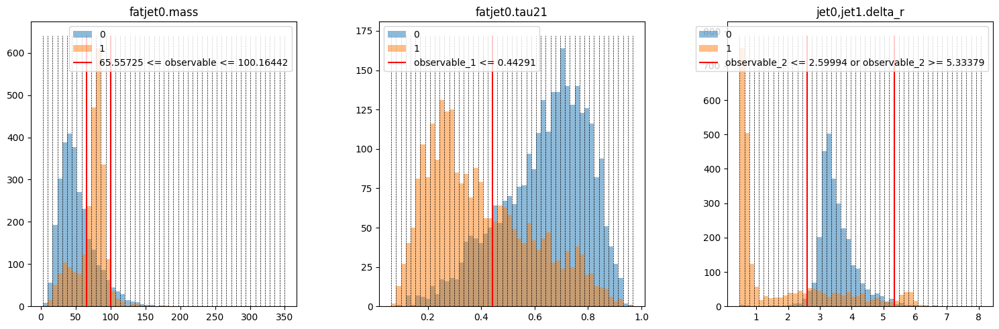
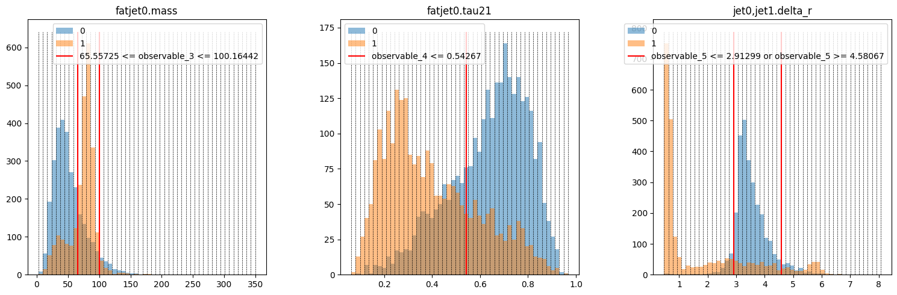
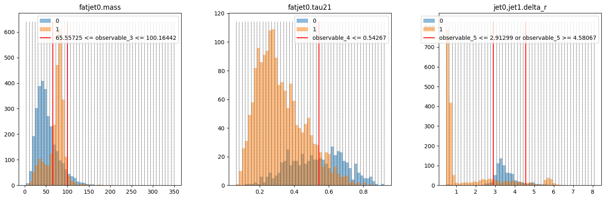

# Applying Approaches

This guide shows how to use the three built-in approaches to differentiate signal and background. HML streamlines the application of different approaches by adapting them in Keras-style (compile, fit, predict), which is simple to use.

Let's get started by importing the necessary modules:

```python
# General
import numpy as np
import matplotlib.pyplot as plt
from keras import ops
from rich.table import Table
# Dataset
from hml.datasets import load_dataset
# Approaches
from hml.approaches import CutAndCount as CNC
from hml.approaches import GradientBoostedDecisionTree as BDT
from hml.approaches import SimpleCNN as CNN
from hml.approaches import SimpleMLP as MLP
# Evaluation
from keras.metrics import Accuracy, AUC
from sklearn.metrics import roc_curve
from hml.metrics import MaxSignificance, RejectionAtEfficiency
# Save and load
from hml.approaches import load_approach
```

Then we use a dictionary to store the benchmark results and define a helper function to get result for each approach:

```python
results = {}

def get_result(approach, x_test, y_test):
    y_pred = approach.predict(x_test, verbose=0)

    fpr, tpr, _ = roc_curve(y_test, y_pred[:, 1])

    result = {
        approach.name: {
            "acc": convert_to_numpy(Accuracy()(y_test, y_pred.argmax(axis=1))).item(),
            "auc": convert_to_numpy(AUC()(y_test, y_pred[:, 1])).item(),
            "sig": convert_to_numpy(MaxSignificance()(y_test, y_pred)).item(),
            "r50": convert_to_numpy(RejectionAtEfficiency(0.5)(y_test, y_pred)).item(),
            "r99": convert_to_numpy(RejectionAtEfficiency(0.99)(y_test, y_pred)).item(),
            "fpr": fpr,
            "tpr": tpr,
        }
    }

    return result
```

## Cut and count

`CutAndCount` approach is a simple cut-based analysis. It uses a set of cuts on observables to separate signal and background. It has two topologies to apply cuts: `parallel` and `sequential`. The `parallel` topology applies all cuts simultaneously, while the `sequential` topology applies cuts one by one.

```python
# Dataset
ds = load_dataset("./data/wjj_vs_qcd_set.ds")

x_train, y_train = ds.train.samples, ds.train.targets
x_test, y_test = ds.test.samples, ds.test.targets
```

```python
# Training
cnc1 = CNC(
    n_observables=3,
    topology="parallel",
    name="cnc_parallel",
)
cnc1.compile(
    optimizer="adam",
    loss="crossentropy",
    metrics=["accuracy"],
    run_eagerly=True,
)
cnc1.fit(x_train, y_train, batch_size=len(x_train))
```

<div class="result" markdown>

```
1/1 ━━━━━━━━━━━━━━━━━━━━ 7s 7s/step - accuracy: 0.7631 - loss: 3.8179
```

</div>

```python
# Training
cnc2 = CNC(
    n_observables=3,
    topology="sequential",
    name="cnc_sequential",
)
cnc2.compile(
    optimizer="adam",
    loss="crossentropy",
    metrics=["accuracy"],
    run_eagerly=True,
)
cnc2.fit(x_train, y_train, batch_size=len(x_train))
```

<div class="result" markdown>
```
1/1 ━━━━━━━━━━━━━━━━━━━━ 5s 5s/step - accuracy: 0.7968 - loss: 3.2749
```

</div>

We could see that the `sequential` topology has a better performance than the `parallel` topology. It's reasonable because the `sequential` topology applies cuts one by one, which determines the best cut according to the current distribution not the original one.

Now add the results to the dictionary:

```python
results.update(get_result(cnc1, x_test, y_test))
results.update(get_result(cnc2, x_test, y_test))
```

## Boosted Decision Tree

We adapt `GradientBoostingClassifier` from `sklearn` to work as a `Keras` model:

```python
# Dataset
ds = load_dataset("./data/wjj_vs_qcd_set.ds")

x_train, y_train = ds.train.samples, ds.train.targets
x_test, y_test = ds.test.samples, ds.test.targets
```

```python
# Training
bdt = BDT(name="bdt")
bdt.compile(metrics=["accuracy"])
bdt.fit(x_train, y_train)
```

<div class="result" markdown>

```
100/100 ━━━━━━━━━━━━━━━━━━━━ 2s 18ms/step - loss: 0.5614 - accuracy: 0.9005
```

</div>

- The `optimizer` and `loss` have any effect in `compile` because `sklearn` will handle them internally.
- `batch_size` and `epochs` are irrelevant for a tree.
- The progress bar displays the number of estimators rather than training steps.

Add the results to the dictionary:

```python
results.update(get_result(bdt, x_test, y_test))
```

## Simple Multi-Layer Perceptron

Currently, HML provides a toy multi-layer perceptron to perform simple analysis:

```python
# Dataset
ds = load_dataset("./data/wjj_vs_qcd_set.ds")

x_train, y_train = ds.train.samples, ds.train.targets
x_test, y_test = ds.test.samples, ds.test.targets

scaler = MinMaxScaler()
x_train = scaler.fit_transform(x_train)
x_test = scaler.transform(x_test)
```

```python
mlp = MLP(name="mlp", input_shape=x_train.shape[1:])
mlp.summary()
```

<div class="result" markdown>

```
Model: "mlp"
┏━━━━━━━━━━━━━━━━━━━━━━━━━━━━━━━━━┳━━━━━━━━━━━━━━━━━━━━━━━━┳━━━━━━━━━━━━━━━┓
┃ Layer (type)                    ┃ Output Shape           ┃       Param # ┃
┡━━━━━━━━━━━━━━━━━━━━━━━━━━━━━━━━━╇━━━━━━━━━━━━━━━━━━━━━━━━╇━━━━━━━━━━━━━━━┩
│ dense_4 (Dense)                 │ (None, 32)             │           128 │
├─────────────────────────────────┼────────────────────────┼───────────────┤
│ dense_5 (Dense)                 │ (None, 64)             │         2,112 │
├─────────────────────────────────┼────────────────────────┼───────────────┤
│ dense_6 (Dense)                 │ (None, 32)             │         2,080 │
├─────────────────────────────────┼────────────────────────┼───────────────┤
│ dense_7 (Dense)                 │ (None, 2)              │            66 │
└─────────────────────────────────┴────────────────────────┴───────────────┘
Total params: 4,386 (17.13 KB)
Trainable params: 4,386 (17.13 KB)
Non-trainable params: 0 (0.00 B)
```

```python
# Training
mlp.compile(loss="crossentropy", metrics=["accuracy"])
mlp.fit(x_train, y_train, batch_size=128, epochs=100)
```

<div class="result" markdown>

```
Epoch 1/100
99/99 ━━━━━━━━━━━━━━━━━━━━ 2s 7ms/step - accuracy: 0.7172 - loss: 0.5586
Epoch 2/100
99/99 ━━━━━━━━━━━━━━━━━━━━ 0s 3ms/step - accuracy: 0.8607 - loss: 0.3469
...
Epoch 99/100
99/99 ━━━━━━━━━━━━━━━━━━━━ 0s 3ms/step - accuracy: 0.9025 - loss: 0.2489
Epoch 100/100
99/99 ━━━━━━━━━━━━━━━━━━━━ 0s 3ms/step - accuracy: 0.9031 - loss: 0.2483
```

</div>

## Simple Convolutional Neural Network

We also provide a toy CNN to perform simple analysis. There're two ways to normalize the images: using the maximum value of each image or applying `log` to each pixel.

```python
# Dataset
ds = load_dataset("./data/wjj_vs_qcd_image.ds")

x_train, y_train = ds.train.samples, ds.train.targets
x_test, y_test = ds.test.samples, ds.test.targets

non_zero_train = x_train.reshape(x_train.shape[0], -1).sum(1) != 0
non_zero_test = x_test.reshape(x_test.shape[0], -1).sum(1) != 0

x_train, y_train = x_train[non_zero_train], y_train[non_zero_train]
x_test, y_test = x_test[non_zero_test], y_test[non_zero_test]

x_train = (
    x_train.reshape(len(x_train), -1)
    / x_train.reshape(len(x_train), -1).max(1, keepdims=True)
).reshape(x_train.shape)
x_test = (
    x_test.reshape(len(x_test), -1)
    / x_test.reshape(len(x_test), -1).max(1, keepdims=True)
).reshape(x_test.shape)
x_train = x_train[..., None]
x_test = x_test[..., None]
```

```python
cnn1 = CNN(name="cnn_max", input_shape=x_train.shape[1:])
cnn1.summary()
```

<div class="result" markdown>

```
Model: "cnn_max"
┏━━━━━━━━━━━━━━━━━━━━━━━━━━━━━━━━━┳━━━━━━━━━━━━━━━━━━━━━━━━┳━━━━━━━━━━━━━━━┓
┃ Layer (type)                    ┃ Output Shape           ┃       Param # ┃
┡━━━━━━━━━━━━━━━━━━━━━━━━━━━━━━━━━╇━━━━━━━━━━━━━━━━━━━━━━━━╇━━━━━━━━━━━━━━━┩
│ conv2d_3 (Conv2D)               │ (None, 33, 33, 8)      │            80 │
├─────────────────────────────────┼────────────────────────┼───────────────┤
│ conv2d_4 (Conv2D)               │ (None, 16, 16, 16)     │         1,168 │
├─────────────────────────────────┼────────────────────────┼───────────────┤
│ conv2d_5 (Conv2D)               │ (None, 8, 8, 32)       │         4,640 │
├─────────────────────────────────┼────────────────────────┼───────────────┤
│ max_pooling2d_1 (MaxPooling2D)  │ (None, 4, 4, 32)       │             0 │
├─────────────────────────────────┼────────────────────────┼───────────────┤
│ global_average_pooling2d_1      │ (None, 32)             │             0 │
│ (GlobalAveragePooling2D)        │                        │               │
├─────────────────────────────────┼────────────────────────┼───────────────┤
│ dropout_1 (Dropout)             │ ?                      │             0 │
├─────────────────────────────────┼────────────────────────┼───────────────┤
│ dense_10 (Dense)                │ (None, 2)              │            66 │
├─────────────────────────────────┼────────────────────────┼───────────────┤
│ dense_11 (Dense)                │ (None, 2)              │             6 │
└─────────────────────────────────┴────────────────────────┴───────────────┘
Total params: 5,960 (23.28 KB)
Trainable params: 5,960 (23.28 KB)
Non-trainable params: 0 (0.00 B)
```

</div>

```python
# Training
cnn1.compile(
    optimizer="adam",
    loss="crossentropy",
    metrics=["accuracy"],
)

cnn1.fit(
    x_train,
    y_train,
    epochs=100,
    batch_size=128,
)

results.update(get_result(cnn1, x_test, y_test))
```

<div class="result" markdown>

```
Epoch 1/100
98/98 ━━━━━━━━━━━━━━━━━━━━ 3s 13ms/step - accuracy: 0.5247 - loss: 0.6885
Epoch 2/100
98/98 ━━━━━━━━━━━━━━━━━━━━ 0s 4ms/step - accuracy: 0.6175 - loss: 0.6423
...
Epoch 99/100
98/98 ━━━━━━━━━━━━━━━━━━━━ 0s 4ms/step - accuracy: 0.8224 - loss: 0.4165
Epoch 100/100
98/98 ━━━━━━━━━━━━━━━━━━━━ 0s 4ms/step - accuracy: 0.8115 - loss: 0.4251
```
</div>

```python
# Dataset
ds = load_dataset("./data/wjj_vs_qcd_image.ds")

x_train, y_train = ds.train.samples, ds.train.targets
x_test, y_test = ds.test.samples, ds.test.targets

non_zero_train = x_train.reshape(x_train.shape[0], -1).sum(1) != 0
non_zero_test = x_test.reshape(x_test.shape[0], -1).sum(1) != 0

x_train, y_train = x_train[non_zero_train], y_train[non_zero_train]
x_test, y_test = x_test[non_zero_test], y_test[non_zero_test]

x_train = np.log(x_train + 1)
x_test = np.log(x_test + 1)
x_train = x_train[..., None]
x_test = x_test[..., None]
```

```python
# Training
cnn2 = CNN(name="cnn_log", input_shape=x_train.shape[1:])

cnn2.compile(
    optimizer="adam",
    loss="crossentropy",
    metrics=["accuracy"],
)

cnn2.fit(
    x_train,
    y_train,
    epochs=100,
    batch_size=128,
)

results.update(get_result(cnn2, x_test, y_test)
```

<div class="result" markdown>

```
Epoch 1/100
98/98 ━━━━━━━━━━━━━━━━━━━━ 3s 13ms/step - accuracy: 0.5914 - loss: 0.6731
Epoch 2/100
98/98 ━━━━━━━━━━━━━━━━━━━━ 0s 4ms/step - accuracy: 0.7587 - loss: 0.5235
...
Epoch 99/100
98/98 ━━━━━━━━━━━━━━━━━━━━ 0s 4ms/step - accuracy: 0.8278 - loss: 0.3906
Epoch 100/100
98/98 ━━━━━━━━━━━━━━━━━━━━ 0s 4ms/step - accuracy: 0.8424 - loss: 0.3684
```

</div>

## Evaluation

```python
table = Table(
    "Name",
    "ACC",
    "AUC",
    "Significance",
    "R50",
    "R99",
    title="Approach Comparison",
)

for name, metrics in results.items():
    table.add_row(
        name,
        f"{metrics['acc']:.6f}",
        f"{metrics['auc']:.6f}",
        f"{metrics['sig']:.6f}",
        f"{metrics['r50']:.6f}",
        f"{metrics['r99']:.6f}",
    )

table
```

<div class="result" markdown>

<style>
    pre.small-text {
        font-size: 12px; /* Adjust this value to increase or decrease the font size */
        font-family: Menlo, 'DejaVu Sans Mono', consolas, 'Courier New', monospace;
        line-height: normal;
        overflow-x: auto;
        white-space: pre;
    }
</style>
<pre class="small-text">
                             Approach Comparison                              
┏━━━━━━━━━━━━━━━━┳━━━━━━━━━━┳━━━━━━━━━━┳━━━━━━━━━━━━━━┳━━━━━━━━━━━┳━━━━━━━━━━┓
┃ Name           ┃ ACC      ┃ AUC      ┃ Significance ┃ R50       ┃ R99      ┃
┡━━━━━━━━━━━━━━━━╇━━━━━━━━━━╇━━━━━━━━━━╇━━━━━━━━━━━━━━╇━━━━━━━━━━━╇━━━━━━━━━━┩
│ cnc_parallel   │ 0.765086 │ 0.743599 │ 34.742661    │ 4.256874  │ 1.000000 │
│ cnc_sequential │ 0.805868 │ 0.788848 │ 37.796890    │ 5.151141  │ 1.000000 │
│ bdt            │ 0.899797 │ 0.952525 │ 44.131214    │ 86.015831 │ 1.997420 │
│ mlp            │ 0.899428 │ 0.952812 │ 44.129673    │ 95.070129 │ 1.974135 │
│ cnn_max        │ 0.809667 │ 0.873104 │ 39.128853    │ 18.534716 │ 1.261342 │
│ cnn_log        │ 0.810978 │ 0.874385 │ 38.911655    │ 19.270756 │ 1.225999 │
└────────────────┴──────────┴──────────┴──────────────┴───────────┴──────────┘
</pre>

</div>

```python
for name, metrics in results.items():
    fpr = metrics["fpr"]
    tpr = metrics["tpr"]
    plt.plot(fpr, tpr, label=f"{name}")

plt.title("ROC Curves")
plt.xlabel("Efficiency")
plt.ylabel("Mistag Rate")
plt.legend()
plt.show()
```

<div class="result" markdown>



</div>


## Plot the cuts on distributions

```python
ds = load_dataset("./data/wjj_vs_qcd_set.ds")

x_train, y_train = ds.train.samples, ds.train.targets
x_test, y_test = ds.test.samples, ds.test.targets
```

```python
fig, axs = plt.subplots(1, 3, figsize=(15, 5))
for i in range(x_train.shape[1]):
    layer = cnc1.cut_layers[i]

    observable = ds.feature_names[i]
    bin_edges = np.linspace(
        x_train[:, i].min(), x_train[:, i].max(), cnc1.n_bins + 1
    )

    axs[i].hist(x_test[:, i][y_test == 0], bins=bin_edges, alpha=0.5, label="0")
    axs[i].hist(x_test[:, i][y_test == 1], bins=bin_edges, alpha=0.5, label="1")

    y_min, y_max = axs[i].get_ylim()
    axs[i].vlines(bin_edges, y_min, y_max, color="k", ls="dashed", lw=0.5)

    if layer.case == 0:
        axs[i].vlines(layer.cut_left, y_min, y_max, color="r", label=layer.cut)
    elif layer.case == 1:
        axs[i].vlines(layer.cut_right, y_min, y_max, color="r", label=layer.cut)
    elif layer.case == 2:
        axs[i].vlines(layer.cut_left, y_min, y_max, color="r", label=layer.cut)
        axs[i].vlines(layer.cut_right, y_min, y_max, color="r")
    else:
        axs[i].vlines(layer.cut_left, y_min, y_max, color="r", label=layer.cut)
        axs[i].vlines(layer.cut_right, y_min, y_max, color="r")

    axs[i].set_title(f"{observable}")
    axs[i].legend()

plt.tight_layout()
plt.show()
```

<div class="result" markdown>



</div>

```python
fig, axs = plt.subplots(1, 3, figsize=(15, 5))
for i in range(x_train.shape[1]):
    layer = cnc2.cut_layers[i]

    observable = ds.feature_names[i]
    bin_edges = np.linspace(
        x_train[:, i].min(), x_train[:, i].max(), cnc2.n_bins + 1
    )

    axs[i].hist(x_test[:, i][y_test == 0], bins=bin_edges, alpha=0.5, label="0")
    axs[i].hist(x_test[:, i][y_test == 1], bins=bin_edges, alpha=0.5, label="1")

    y_min, y_max = axs[i].get_ylim()
    axs[i].vlines(bin_edges, y_min, y_max, color="k", ls="dashed", lw=0.5)

    if layer.case == 0:
        axs[i].vlines(layer.cut_left, y_min, y_max, color="r", label=layer.cut)
    elif layer.case == 1:
        axs[i].vlines(layer.cut_right, y_min, y_max, color="r", label=layer.cut)
    elif layer.case == 2:
        axs[i].vlines(layer.cut_left, y_min, y_max, color="r", label=layer.cut)
        axs[i].vlines(layer.cut_right, y_min, y_max, color="r")
    else:
        axs[i].vlines(layer.cut_left, y_min, y_max, color="r", label=layer.cut)
        axs[i].vlines(layer.cut_right, y_min, y_max, color="r")

    axs[i].set_title(f"{observable}")
    axs[i].legend()

plt.tight_layout()
plt.show()
```

<div class="result" markdown>



</div>

```python
cut_layers = cnc2.cut_layers
mask_train = ops.squeeze(ops.where(ops.ones(x_train.shape[0]) == 1))
mask_test = ops.squeeze(ops.where(ops.ones(x_test.shape[0]) == 1))

plt.figure(figsize=(15, 5))
for i in range(x_train.shape[1]):
    plt.subplot(1, 3, i + 1)
    layer = cut_layers[i]

    masked_x_train = ops.convert_to_numpy(ops.take(x_train[:, i], mask_train))
    masked_y_train = ops.convert_to_numpy(ops.take(y_train, mask_train))
    bin_edges = np.linspace(masked_x_train.min(), masked_x_train.max(), 50 + 1)
    mask_train = ops.squeeze(ops.where(cut_layers[i].apply_cut(x_train) == 1))

    masked_x_test = ops.convert_to_numpy(ops.take(x_test[:, i], mask_test))
    masked_y_test = ops.convert_to_numpy(ops.take(y_test, mask_test))
    mask_test = ops.squeeze(ops.where(cut_layers[i].apply_cut(x_test) == 1))

    plt.hist(masked_x_test[masked_y_test == 0], bins=bin_edges, alpha=0.5, label="0")
    plt.hist(masked_x_test[masked_y_test == 1], bins=bin_edges, alpha=0.5, label="1")

    y_min, y_max = plt.gca().get_ylim()
    plt.vlines(bin_edges, y_min, y_max, color="k", ls="dashed", lw=0.5)

    if layer.case == 0:
        plt.vlines(layer.cut_left, y_min, y_max, color="r", label=layer.cut)
    elif layer.case == 1:
        plt.vlines(layer.cut_left, y_min, y_max, color="r", label=layer.cut)
    elif layer.case == 2:
        plt.vlines(layer.cut_left, y_min, y_max, color="r", label=layer.cut)
        plt.vlines(layer.cut_right, y_min, y_max, color="r")
    else:
        plt.vlines(layer.cut_left, y_min, y_max, color="r", label=layer.cut)
        plt.vlines(layer.cut_right, y_min, y_max, color="r")

    plt.title(ds.feature_names[i])
    plt.legend()
plt.tight_layout()
plt.show()
```

<div class="result" markdown>



</div>

## Save and load approaches

After `fit` each approach, use `save` to save it to a file. To make folder structure clean, let’s create a folder named “checkpoints” first:

```bash
mkdir checkpoints
```

Then, in your codes or the notebook:

```python
cnc1.save("./checkpoints/cnc_parallel.keras")
cnc2.save("./checkpoints/cnc_sequential.keras")
bdt.save("./checkpoints/bdt.pickle")
mlp.save("./checkpoints/mlp.keras")
cnn1.save("./checkpoints/cnn1.keras")
cnn2.save("./checkpoints/cnn2.keras")
```

Once again, we use `load_approach` to let HML decide which class it actually is, just like `parse_observable`, `load_dataset`:

```python
loaded_cnc1 = load_approach("./checkpoints/cnc_parallel.keras")
loaded_cnc2 = load_approach("./checkpoints/cnc_sequential.keras")
loaded_bdt = load_approach("./checkpoints/bdt.pickle")
loaded_mlp = load_approach("./checkpoints/mlp.keras")
loaded_cnn1 = load_approach("./checkpoints/cnn1.keras")
loaded_cnn2 = load_approach("./checkpoints/cnn2.keras")
```

Check the doc to learn more about [cuts](../api/hml.approaches/cuts.md), [trees](../api/hml.approaches/trees.md), and networks.
